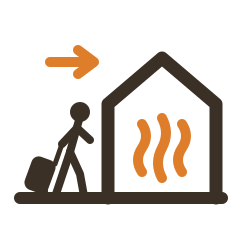

# Warm Welcome



A Home Assistant custom integration for slow heating systems (e.g. floor
heating). While you are away, your heating is turned down. Based on the
weather forecast and the known heating rate of each room, this integration
predicts **exactly when the heating must be turned back on** so the room is
warm the moment you return from vacation — and turns it on at that moment.

Lowering the heating when you leave is up to you (manually or via your own
automation); this integration handles the predictive re-heat.

## How it works

Every 30 minutes (and whenever a source entity changes) the integration
walks backward per room from your arrival time through the outdoor
temperature forecast, accumulating the degrees the room gains per hour at
the forecasted outdoor temperature, until the gap between the current and
the target room temperature is covered. That point in time — moved earlier
by the configured floor warm-up time — is the heating start.

When the start moment arrives (and the vacation end is still in the
future), the enabled actions are executed once per vacation: first the
preset is set (if enabled), then — after a short pause so the preset's
setpoint is applied first — the target temperature (if enabled), overriding
the preset's setpoint. The "already triggered" flag survives Home Assistant
restarts; if Home Assistant was down at the computed moment, the actions
fire immediately after startup.

If the vacation end entity is unset or in the past, the integration idles
and the sensors show `unknown`.

## Installation

Requires Home Assistant 2026.3 or newer.

- **HACS (recommended):** add this repository as a **custom repository** of
  type *Integration*, install **Warm Welcome**, and restart Home Assistant.
- **Manual:** copy `custom_components/warm_welcome` into the
  `custom_components` folder of your Home Assistant configuration directory
  and restart.

## Configuration

Everything is configured in the UI: **Settings → Devices & services →
Add integration → Warm Welcome**. The integration is added once with the
shared settings; then add each room via **Add room** on the integration's
page.

All temperature fields follow your Home Assistant unit system (°C or °F);
if you ever switch the unit system, re-enter the configured temperatures in
the new unit. Everything can be changed later: the shared settings via the
entry's **Configure** menu, each room (including its name) via the room's
**Reconfigure** menu.

### Shared settings

- **Weather entity** — provides the outdoor temperature forecast (hourly
  preferred, falls back to twice-daily/daily).
- **Vacation end entity** — an `input_datetime` (with time enabled) or
  `datetime` entity holding the date and time you return.
- **Floor warm-up time** — how long the heating spends warming the floor's
  thermal mass before the floor emits heat into the room, often 2–3 hours
  for floor heating (default 0). Every room's heating starts this much
  earlier to compensate.

### Per room

Adding a room has two steps: first the name and climate entity, then the
heat rates and actions — the preset choices in the second step come from
the climate entity you picked in the first.

- **Climate entity** — the room's thermostat (provides the current room
  temperature and receives the re-heat command).
- **Heat rate map** — measurements of how fast the room heats up at
  specific outdoor temperatures, e.g. "at -10° outside the room gained 1°
  in 5 hours". Rates between the mapped points are interpolated linearly
  and clamped outside the range. The gain may be negative if your heating
  cannot keep up at very low outdoor temperatures; the prediction then
  starts correspondingly earlier so warmer hours compensate.
- **Actions** — whether to set a preset and/or a temperature at the
  heating start, one checkbox each (at least one must be enabled). The
  preset dropdown offers the presets advertised by the climate entity
  (e.g. `comfort`, `eco`, `boost`).
- **Preset temperatures** (optional) — the temperature each preset heats
  to, e.g. `comfort: 21`, `eco: 17`. Informational only — nothing from it
  is ever sent to the climate entity (see below).
- **Target temperature** — what the room should be when you arrive.

The action toggles, target preset, and target temperature can also be
adjusted on the fly without reopening this dialog — see
[Configuration entities](#configuration-entities).

<details>
<summary><b>Which temperature does the prediction aim for?</b></summary>

Presets switch the thermostat to a setpoint configured inside the climate
device, which this integration cannot read — the preset temperature map
fills that gap. When only the preset action is enabled, the prediction
targets the mapped temperature of the selected preset (falling back to the
target temperature if the preset is not mapped). When setting the
temperature is enabled, the prediction always targets the target
temperature, since it is sent after the preset and overrides its setpoint.

</details>

### Determining your heat rates

Turn the heating on from a cooled-down state on days with different outdoor
temperatures and note how many degrees the room gained over how many hours —
that measurement is entered directly, no conversion to an hourly rate
needed. One or two points are enough to start; add more points for better
predictions. If the room *loses* temperature despite full heating on very
cold days, enter that as a negative gain.

### Configuration entities

For quick adjustments (and for use in automations), each room's device also
exposes its main settings as configuration entities. Changing them writes
straight back into the room's configuration, and the prediction updates
immediately:

| Entity | Setting |
| --- | --- |
| `number.<room>_warm_welcome_target_temperature` | target temperature |
| `switch.<room>_warm_welcome_use_preset` | set the preset at the heating start |
| `select.<room>_warm_welcome_target_preset` | which preset to set |
| `switch.<room>_warm_welcome_use_temperature` | set the temperature at the heating start |

While a switch is off, its dependent entity (the preset select or the
temperature number) shows as unavailable. The shared **floor warm-up time**
is likewise exposed as a number on the integration's own device
(`number.warm_welcome_floor_warm_up_time`).

## Sensors

Each room provides:

- `sensor.<room>_heating_start` — timestamp of the computed start, with
  diagnostic attributes: required pre-heat hours, temperature deficit,
  the room's current temperature (also kept while idle), forecast type
  used, whether the prediction had to extrapolate beyond the forecast,
  the `predicted_temperatures` chart series (see below), and
  `preheat_active` — true from the moment the integration started the
  heating until the arrival has passed or the room has reached the target
  temperature.
- `sensor.<room>_required_preheat` — required pre-heat duration in hours.
- `binary_sensor.<room>_target_temperature_at_risk` — on when the room is
  predicted to miss the target temperature at the arrival, e.g. because
  the forecast worsened after the heating start had passed or the heating
  cannot keep up with the forecasted cold. Its `target_reached_at`
  attribute (also on the heating start sensor) shows when the room is
  predicted to actually reach the target instead.

The entry itself provides one shared sensor:

- `sensor.warm_welcome_outdoor_forecast` — the outdoor temperature
  forecast the predictions are based on: the state is the forecast for the
  current interval, the `forecast` attribute holds the full series.

## Dashboard card

The integration bundles its own Lovelace card — it is registered
automatically (no HACS frontend module, no resource configuration) and
needs no options. After installing or upgrading, restart Home Assistant
and **hard-refresh the browser** (Cmd/Ctrl+Shift+R) — the frontend's
service worker caches the page that loads the card:

```yaml
type: custom:warm-welcome-card
```

The card subscribes to the integration over websocket and updates live.
It shows one curve per room from its computed heating start (marked with
a dot) to the target temperature at arrival, a dashed vertical marker at
the vacation end, and the outdoor forecast as a dashed blue line on the
same temperature axis. The legend lists each room's start time; a ⚠ marks
predictions that had to extrapolate beyond the forecast. While no future
vacation end is set, the card shows an idle hint and only the outdoor
forecast.

All options are optional and editable in the card's visual editor:

```yaml
type: custom:warm-welcome-card
title: Vacation re-heat   # card header
rooms:                    # subset of rooms and their line colors;
  - name: Living room     # omit to show all rooms with default colors
    color: "#e67e22"
  - Bathroom              # plain names get a default color
show_forecast: false      # hide the outdoor forecast (default: true)
show_legend: false        # hide the legend (default: true)
legend_position: top      # top | bottom (default: bottom)
y_min: 10                 # fix the temperature axis (default: auto-scale
y_max: 25                 # to the plotted curves; either bound alone works)
days: 7                   # show a fixed window of N days from now instead
                          # of auto-scaling the time axis to the arrival
```

Rooms are matched by their name in the integration; with a fixed `days`
window, curves and the arrival marker outside the window are clipped.

## Charting with ApexCharts instead

If you prefer building your own chart (e.g. with the community
[ApexCharts card](https://github.com/RomRider/apexcharts-card)), two
series are exposed as attributes, both as `{datetime, temperature}`
point lists:

- `predicted_temperatures` on each room's `heating_start` sensor — the
  predicted room temperature, from the current temperature at the heating
  start rising to the target at arrival (with a point at every heat-rate
  change),
- `forecast` on the shared `outdoor_forecast` sensor — the outdoor
  temperature forecast used for the predictions.

These attributes are excluded from the recorder (no database growth); they
always reflect the latest prediction, which is recomputed every 30 minutes
and immediately after any source entity or option changes.

With the ApexCharts card (available via HACS) you can plot the timeline
of several rooms in one chart — the point where a room's line starts
rising is its heating start:

```yaml
type: custom:apexcharts-card
header:
  show: true
  title: Vacation re-heat
graph_span: 8d
span:
  start: hour
all_series_config:
  # Stop lines at their last data point instead of extending them
  # flat to the end of the graph (the card's default).
  extend_to: false
series:
  - entity: sensor.living_room_heating_start
    name: Living room
    data_generator: |
      return (entity.attributes.predicted_temperatures || [])
        .map((p) => [new Date(p.datetime), p.temperature]);
  - entity: sensor.bedroom_heating_start
    name: Bedroom
    data_generator: |
      return (entity.attributes.predicted_temperatures || [])
        .map((p) => [new Date(p.datetime), p.temperature]);
  - entity: sensor.warm_welcome_outdoor_forecast
    name: Outside
    type: area
    opacity: 0.2
    data_generator: |
      return (entity.attributes.forecast || [])
        .map((p) => [new Date(p.datetime), p.temperature]);
```

Adjust `graph_span` to cover your longest expected pre-heat plus the time
until arrival. While no vacation end is set, the sensors are `unknown` and
the series are empty.

## Development

Dependencies are managed with [uv](https://docs.astral.sh/uv/):

```bash
uv sync
uv run ruff check .
uv run pytest tests/ -v
```

## Releasing

Publish a GitHub release with a tag like `v0.1.1`. The release workflow
stamps the version into the manifest and uploads `warm_welcome.zip`,
which HACS installs.
